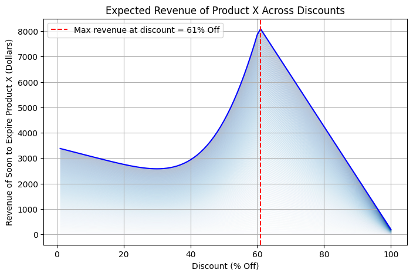
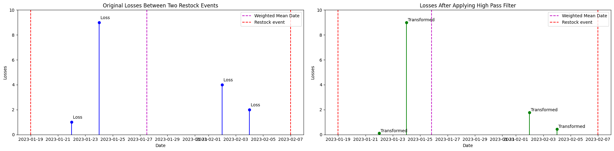
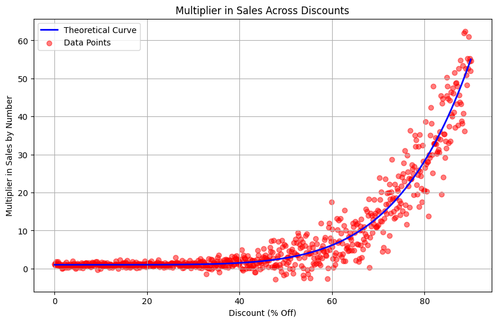

## Inspiration
Food waste represents a significant market and environmental failure, leading to the disposal of over US $1 trillion worth of food annually. It accounts for an estimated 8–10 percent of global greenhouse gas emissions and occupies nearly 30 percent of the world’s agricultural land. This waste not only contributes to habitat loss due to the conversion of natural ecosystems for agriculture but also highlights a profound social issue: while vast amounts of food are discarded, approximately 783 million people suffer from hunger each year, and 150 million children under five experience stunted growth due to nutritional deficiencies.

The UNEP Report clarifies the difference between food waste and food loss. Food waste pertains to food that is discarded or uneaten at the retail and consumption stages. In contrast, food loss occurs during production, storage, processing, and distribution phases. The report, released on March 27, specifically addresses food waste. [Read More](https://wellbeingintl.org/the-food-waste-challenge/?gad_source=1&gclid=CjwKCAjwoa2xBhACEiwA1sb1BLGjX91VOgb2mIOxLPsJB9VgLmQwBqTpNQtwECQgm2yU5cGPZoxoKhoCMsAQAvD_BwE)

## What It Does
We developed a model that predicts the supply and demand for groceries and implemented a discounting algorithm to maximize revenue while minimizing losses. This algorithm enhances demand by offering discounts and calculates the optimal discount rate to both maximize revenue and minimize surplus by the expiry date. Moreover, we have integrated a feature that allows discounts to be directed to local food charities, supporting the use of expired groceries.

## How We Built It

### Coupons Platform
The front end application was built using Next.js and TailwindCSS. The home page contacts the Node.JS backend to retrieve the coupons (stored locally for now) and display them in tiles. It uses the front end for filtering and searching. The suggest deals page contacts the Node.JS backend which then contacts the Square API. It then pulls the inventory and catalog data in order to calculate the suggested prices. This then contacts a python subtask to do the actual calculation. Last, it displays this information in tiles (Note that currently it is set up to display sample data. This is because we were not able to successfully upload enough data to the Square API for demonstration purposes). The checkout page is mostly static website, but it checks for the coupon code banana60 to apply the discount, and displays the checkbox to update the price correctly.


### Discounting Algorithm
Calculating the suggested discounts is no trivial task. For a given product, the algorithm first compares the expected sales by expiration (`expected_sales_by_expiration`) to the current count of the product that is going to expire (`count_exp`). If `expected_sales_by_expiration` is greater than `count_exp`, then there is no need to discount the product. Otherwise, we need to consider discounting the product in question. Since `expected_sales_by_expiration` and `count_exp` are not explicitly provided by the Square API, we need to deduce these values from the data we do have access to. See **Estimating expected_sales_by_expiration** and **Estimating count_exp** below.

After identifying that a store can benefit from discounting a given product, we iterate through each potential discounted price from 0% off to 100% off. For each percent discount, we find the expected revenue by multiplying the discounted price and the expected sales in quantity at the discounted price. For an explanation on how the latter is determined, see **Calculating Expected Sales at Discounted Price** below. We see at which percent discount we maximize the revenue and suggest the percent discount to the user, the shop.


*The chart displays where revenue is maximized for the example data.*

#### Estimating expected_sales_by_expiration

We estimate `expected_sales_by_expiration` by multiplying the remaining days to expiration (`dte`) and the expected sales in quantity per day of the soon to expire count.

Since `dte` is not explicitly provided by the Square API, days to expiration is estimated in the following manner:

1. Restocks are somewhat periodic and consistent in amount and the number of days a product lasts before expiration upon delivery to the store is fairly consistent per product.
2. Patterns in recent past data on losses can be extrapolated to predict the current days to expiration.
3. Within a period between two restock events, the loss event or group of loss events with the greatest quantity lost is due to inventory expiring.

Next, we look at past data to extrapolate `dte`. In the 6 most recent restock events (which we take from the Square API), we average days past between loss events and their respective most recent restock event. These averages are quadratically weighted averages based on amount lost per loss event. We quadratically weight averages to further attenuate the smaller losses, which concurs with the third assumption. The effect of quadratically weighting the losses to obtain the average number of days since the last restock can be shown in the example below.


*This example is only for the time between two restock events. In practice, we average the weighted averages among each period of consecutive restock events to obtain the average.*

Note that the weighted mean date is closer to the date of the largest loss event, which is desirable under the third assumption. We take this value and subtract the number of days since the last restock event. Since the difference can be negative, we apply the modulus function to the difference with the average number of days between consecutive restock events. This new value is `dte`. The modulus function can be used because the number of days a product takes to expire since its delivery to the store can be longer than the number of days between two or more consecutive restock events. Applying the modulus function covers these cases and is appropriate for the method we calculate `dte`. Note that this relies on the first assumption.

To calculate the expected sales in quantity per day of the soon to expire count, we get sales data from the Square API. We take all sales made from the last 2 times `dte` days and get an average sales per day. The average is calculated by weighting the most recent sales more heavily as more recent data is more relevant to the sellability of a product.

#### Estimate count_exp

Note that for a given product, the current inventory count is not a sufficient estimate for `count_exp` as the inventory may have a mix of soon to expire items and recently restocked items. To calculate the `count_exp`, we simply calculate the average quantity loss per consecutive restock events across the last 6 restock events. To do this, we obtain the data from the Square API.

#### Calculating Expected Sales at Discounted Price

In order to calculate the expected sales in quantity at the discounted price, we need some insight as to the effect of discounts on sales. In order to create a model for a general product, we mined the internet for data. We also had to clean the data so that variables were consistent. For example, 75% of the original price should translate to 25% off and a 67% increase in sales should be a multiplier of 1.67. Any suggested formulas were turned into a set of 50 data points. We tried to diversify the products being studied to create a more general model for simplicity. Once the data points were plotted we were able to formulate an equation that models the general effect of discounts on sales.



## Challenges We Ran Into
Currently, the Square API only lets new inventory changes be logged in the past 24 hours. This makes it difficult to upload a meaningful dataset for testing the discounting algorithm. To overcome this obstacle, we opted for a temporary solution of utilizing a separate, locally stored dataset. However, we ensured this data aligns seamlessly with the structure and format expected by the Square API to facilitate a smooth transition when the API capabilities are expanded.

Another challenge arose from the Square API's lack of support for automated coupon code generation. Currently, store owners need to manually input any discounts offered. This limitation significantly hinders the automation of the discount application process, which was a core aspect of our vision for Square Coupons. We are actively seeking workarounds or future updates to the Square API that would allow for automatic coupon creation and implementation. 

## Accomplishments That We're Proud Of
The heart of Square Coupons lies in the discounting algorithm, and we're immensely proud of its development. This algorithm tackles the crucial task of predicting both product supply and demand within the grocery store environment. By factoring in these considerations, the algorithm calculates an optimal discount price that maximizes revenue for the store while minimizing food waste. This innovative approach not only benefits businesses but also contributes to a larger societal good by reducing food spoilage. We believe this algorithm has the potential to be a powerful tool in addressing the global issue of food waste.

## What We Learned
Throughout the development of Square Coupons, we gained valuable experience working with various technologies. We honed our skills in utilizing REST APIs, specifically the Square API, to integrate with Point-of-Sale systems. Additionally, we deepened our understanding of frameworks like React and Node.JS, which were instrumental in building the front-end and back-end functionalities of the application. This project also provided us with a unique opportunity to gain valuable insights into the complexities of the grocery retail industry. Understanding these intricacies was crucial in tailoring the features of Square Coupons to address the specific needs and challenges faced by grocery stores.

## What's Next for Square Coupons
We envision a future where Square Coupons becomes seamlessly integrated with the Square API. The current limitations we encountered highlight the need for API advancements that cater to applications like ours. Ideally, we hope to see functionalities that allow for historical data access beyond 24 hours and the ability to automatically generate and implement discount coupons. We believe that closer collaboration and continued development of the Square API will unlock the full potential of Square Coupons, enabling it to make a significant impact on food waste reduction and grocery store efficiency.

Square Coupons isn't Square-exclusive! We're looking to collaborate with Block, Inc. (formerly Square) to integrate with Cash App. This widens our reach to Cash App's massive user base, potentially reducing food waste further. Imagine the ease of using Cash App for discounted groceries! Integrating Cash App requires evaluation, but the Block ecosystem holds immense potential. We're also exploring Cash App Boosts and marketing to maximize Square Coupons' impact within Block.

## Getting Started

First, run the development server:

```bash
npm run dev
# or
yarn dev
# or
pnpm dev
# or
bun dev
```

Open [http://localhost:3000](http://localhost:3000) with your browser to see the result.

This project uses [`next/font`](https://nextjs.org/docs/basic-features/font-optimization) to automatically optimize and load Inter, a custom Google Font.
